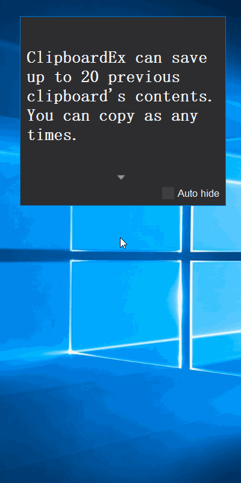

    Language:
    🇺🇸
    <a title="Chinese" href="docs/README_zh.md">🇨🇳</a>

# 
ClipboardEx

ClipboardEx is a tool to enhance the function of the original clipboard.

## How to use
After open ClipboardEx，Tips Window will show you current clipboard content.

    
     
    Show clipboard content

ClipboardEx can only support picture and text format so far.

## Auto hide
By default, Tips Window always displays on top of the desktop. When you check the "Auto hide" checkbox, it will hide until clipboard updated.

    
     
    Auto hide

## Previous contents
ClipboardEx can save up to 20 previous clipboard's contents. You can copy as any times.

    
     
    Previous contents

## Muti monitor
You can create more than one Tips Windows. It will be very convenient that create Tips Windows according to the number of your monitor, and place one for each monitor.

    
     
    Support muti-monitor

## Quick review
Drag Tips Windows to the monitor's edge, it will move ouside. You can quick review by hit that edge.

    
     
    Dock mode

## Startup
You can enable startup on tray icon menu.