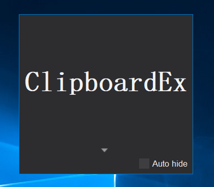
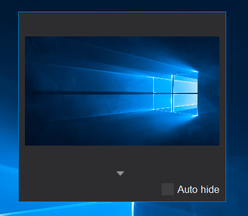
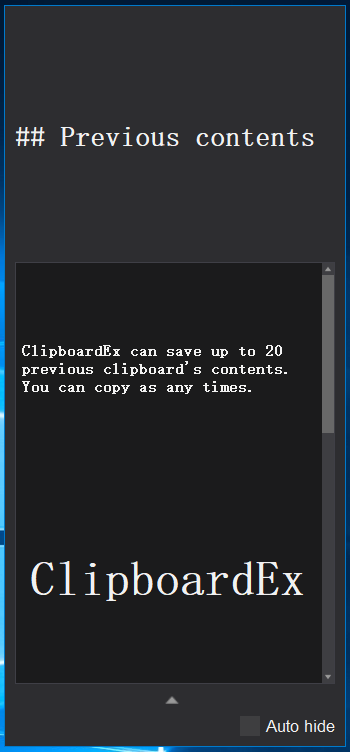
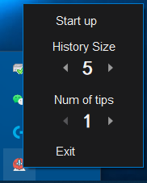
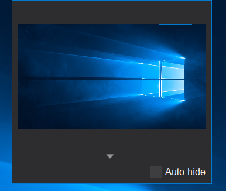

    语言:
    <a title="English" href="../README.md">us</a>
    🇨🇳

# 
ClipboardEx

ClipboardEx装的好，Ctrl CV没烦恼

## 基础使用
开启ClipboardEx后，提示窗口可以显示当前剪贴板的内容

目前仅支持**文字**以及**图片**格式

## 常驻&隐藏
每一个提示窗口可以选择是否自动隐藏。勾选后隐藏，且仅当剪贴板有更新时弹出。否则常驻

## 历史记录
ClipboardEx可以保存多达20个剪贴板的历史记录，并可以随时复制回剪贴板

## 多显示器支持
您可以根据显示器的数量创建多个提示窗口，并将其放到您想要的位置

## 快速查看
提示窗口被拖到显示器边缘时，进入停靠模式。您可以随时移入快速查看。

## 开机启动
在托盘菜单中可以开启或关闭开机启动功能